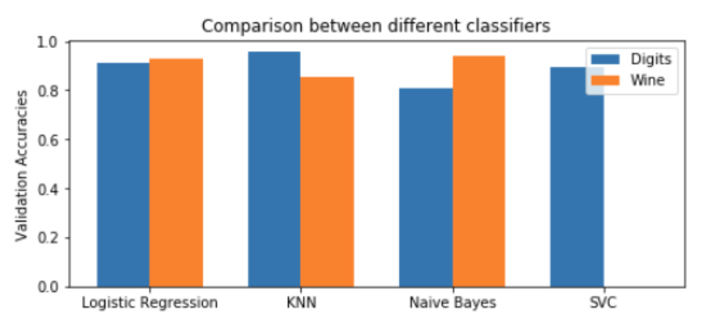

# Multi-Class-Logistic-Regression-and-Gradient-Descent

We implemented, using Python 3, multi-class logistic regression (with softmax) from scratch, recorded its training and validation accuracy, and compared its performance to that of other common classification algorithms, namely: k-nearest neighbors, Naive Bayes, and support-vector machines. Further, our gradient descent optimizer used both momentum and mini-batch, which proved to be especially useful for larger datasets. 

To compare the different classification algorithms, we used the digits and wine datasets from OpenML. Our multi-class logistic regression model yielded a strikingly similar validation accuracy to that of the compared classifiers for both datasets (90.9% for digits and 87.6% for wine). Therefore, our model demonstrated its ability to perform on par with some of the best available out-of-the-box classification algorithms.

